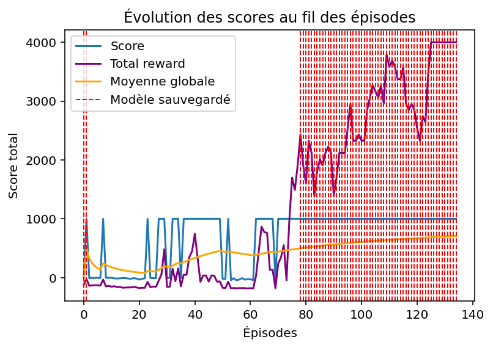

# Deep Q-Learning Space Navigator
## Description  
This project explores the use of **Deep Q-Learning** to optimize space trajectories in a simulated solar system.  
The goal is to train an agent to **launch from Earth and reach a target planet** (e.g., Mars) using reinforcement learning.

We use **Pygame** for visualization, **PyTorch** for deep learning, and a physics simulation that accounts for planetary gravity.

**Current version:** The agent is trained in a system where planets are static.  
**Final goal:** Generalizing the approach to compute **optimal trajectories in any dynamic solar system configuration**.

---

## Project Structure  
- **`train.py`**: Contains the training process using Deep Q-Learning.  
- **`model.pth`**: File storing the trained model weights.  
- **`load_model.py`**: Script to load a trained model and run a simulation.  
- **`performance.png`**: A graph showing the model’s performance over training episodes.  

---

## Final Objective  
The ultimate goal is to create an agent capable of computing the **optimal trajectory** between Earth and a target planet while considering the gravitational influences of celestial bodies. For now, I am working on a more accessible version of the problem to fully grasp its complexities and tackle it step by step.

In this simplified version, the planets are fixed, and we are only aiming for Mars. But the ambition is to extend the algorithm to a dynamic system, enabling automated space missions to be planned in any planetary configuration.

---

## Technologies Used  
- **Python**  
- **Pygame** (visualization)  
- **PyTorch** (Deep Q-Learning)  
- **Matplotlib** (performance visualization)  

---

## Execution  
To train the model:  
```bash
python train.py
```

To load your model and test it:
```bash
python load_model.py
```

# Results

